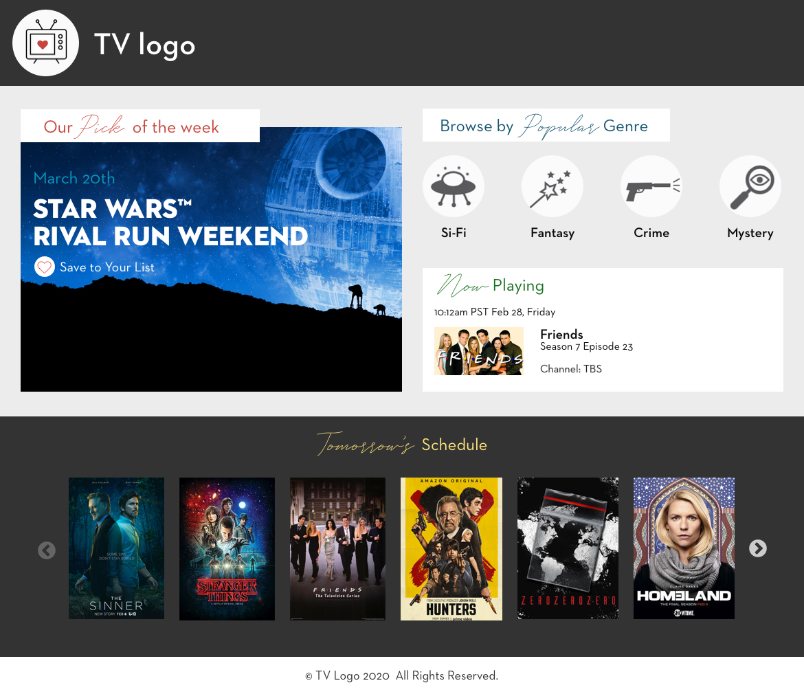
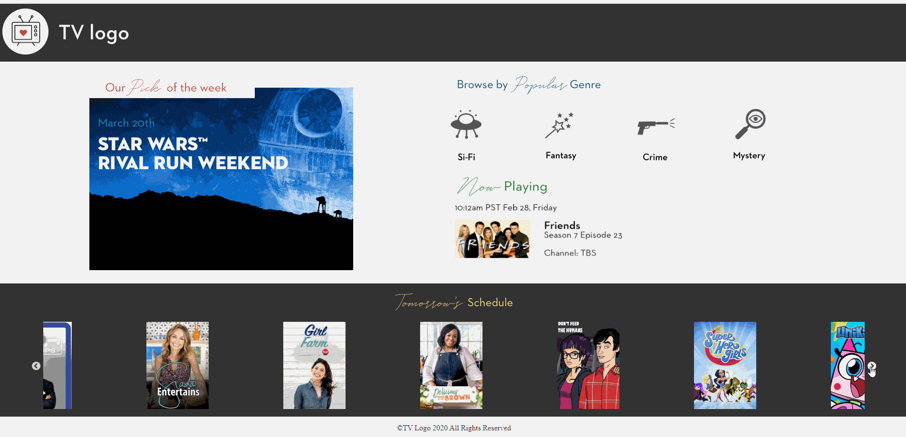

# tv-logo

> - Maintained by: `James Dinh - jdinh8124`

## Link To Live Project
[Link to TV Logo Landing Page Demo](http://tv-logo-challenge.jamestdinh.com/)

## Summary
- A television guide site that allows users to preview upcoming shows using strictly HTML5, CSS3, JavaScript, jQuery, and Slick Slider

## Technologies Used
- JavaScript (ES5 & ES6)
- jQuery
- HTML5
- CSS3
- Slick Slider

### Takeaways
- Css Media Queries are a little more difficult without the boostrap grid system
- Slick Slider CDN is compactable and efficent
- Slick Slider gives us a nice interface and many options to customize it to our UI needs
- Finding tomorrows date is achievable with a little tinkering of the date object

### UX/UI Template

### Live Demo

