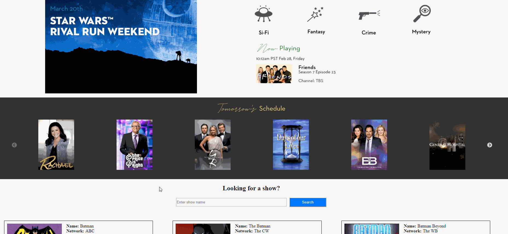
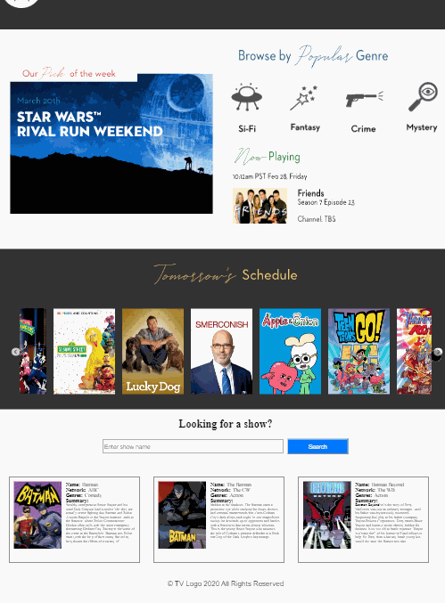
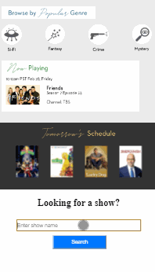

# tv-logo

> - Maintained by: `James Dinh - jdinh8124`

## Link To Live Project
[Link to TV Logo Landing Page Demo](http://tv-logo-challenge.jamestdinh.com/)

## Summary
- A television guide site that allows users to preview upcoming shows using strictly HTML5, CSS3, JavaScript, jQuery, and Slick Slider

## Technologies Used
- JavaScript (ES5 & ES6)
- jQuery
- HTML5
- CSS3
- Slick Slider
- TVmaze API

### Takeaways
- Css Media Queries are a little more difficult without the bootstrap grid system
- Slick Slider CDN is compactable and efficient
- Slick Slider gives us a nice interface and many options to customize it to our UI needs
- Finding tomorrows date is achievable with a little tinkering of the date object
- The Slick Slider needs to be called after the TV schedule API in order to correctly build a slider due to asynchronous actions

### Future additions
- Responsiveness in regard to certain in between viewports
- Y-axis page scrolling
- show icon responsive design
- search feature for shows 

### UX/UI Template

## Live Demo

### Full Screen

### Ipad Pro

### Iphone 6

